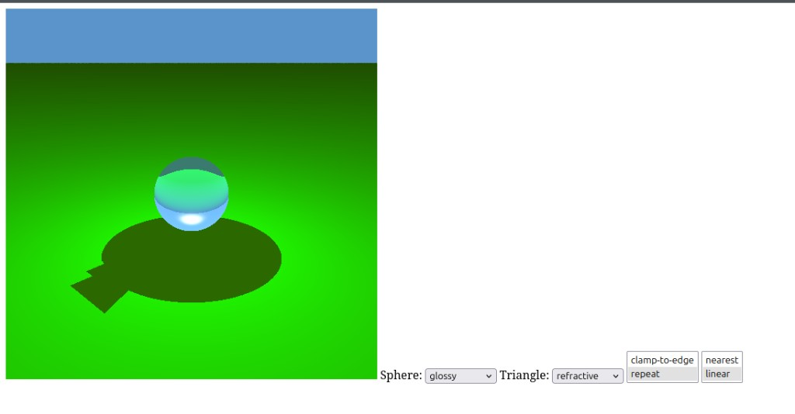

<p align="center">
  
</p>

# WebGPU Ray Tracer

A real-time ray tracer built from scratch in **WGSL** and **JavaScript**, running entirely on the GPU in the browser. The full scene is traced inside a fragment shader — no rendering libraries or frameworks.

## Features

- **GPU ray tracing** in a single WGSL fragment shader
- **Analytic intersections** for planes, triangles, and spheres
- **Material models:** Lambertian, Phong, mirror reflection, refraction (glass), and glossy
- **Texture mapping** with nearest and bilinear filtering, plus clamp-to-edge and repeat addressing
- **Point-light shading** with hard shadows and gamma correction
- **Interactive controls** to switch materials per object and change texture sampling live

## Tech

WebGPU · WGSL · JavaScript (no frameworks)

## Running

Requires a WebGPU-capable browser (Chrome/Edge, or Firefox with `dom.webgpu.enabled`).

```bash
python3 -m http.server 8000
```

Then open <http://localhost:8000/w03p1.html>.

## Controls

- **Sphere / Triangle** — choose the shading model for each object
- **Address mode** — texture wrapping (clamp-to-edge / repeat)
- **Filter** — texture sampling (nearest / linear)
- **Arrow keys** — adjust the camera constant (up/down) and aspect ratio (left/right)
